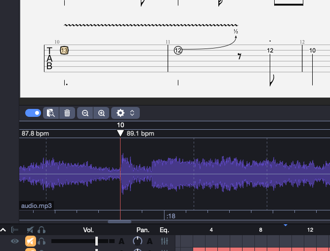

# guitar-pro-youtube-sync

Sync Guitar Pro tabs with real YouTube audio using Songsterr's timing data. Produces a `.gp` file with embedded audio and per-measure tempo mapping so your tab plays back perfectly in time with the original recording.



## What It Does

Songsterr has crowd-sourced timing data that maps each measure of a song's tab to a specific timestamp in a YouTube video. This tool uses that data to:

1. Fetch measure-level timing points from Songsterr's API
2. Download the corresponding YouTube audio via `yt-dlp`
3. Compute per-measure BPMs from the timing data
4. Embed the audio and SyncPoint automations into a Guitar Pro 7/8 file

The result is a `.gp` file you can open in Guitar Pro with a fully synced backing track -- every measure lines up with the real recording.

## Prerequisites

- **Python 3.10+**
- **[yt-dlp](https://github.com/yt-dlp/yt-dlp)** -- for downloading YouTube audio
- **[ffmpeg](https://ffmpeg.org/)** -- for audio conversion (used by yt-dlp)
- **A Guitar Pro 7/8 file (.gp)** for the song you want to sync

### Getting a .gp File

You need a Guitar Pro file to sync against. You can download `.gp` files from Songsterr with a plus account or using [songsterr-downloader](https://github.com/Metaphysics0/songsterr-downloader).

## Installation

```bash
git clone https://github.com/teaqu/guitar-pro-youtube-sync.git
cd guitar-pro-youtube-sync
python -m venv .venv
source .venv/bin/activate
pip install requests
```

Make sure `yt-dlp` and `ffmpeg` are installed and available on your PATH:

```bash
# macOS
brew install yt-dlp ffmpeg

# Linux
pip install yt-dlp
sudo apt install ffmpeg

# Windows
pip install yt-dlp
# Download ffmpeg from https://ffmpeg.org/download.html
```

## Usage

### Basic sync

You can pass either a Songsterr URL or just the song ID:

```bash
python sync.py --song "https://www.songsterr.com/a/wsa/gary-moore-parisienne-walkways-tab-s23063" --gp-file parisienne-walkways.gp
```

```bash
python sync.py --song 23063 --gp-file parisienne-walkways.gp
```

This outputs a `parisienne-walkways_synced.gp` file in the same directory with the YouTube audio embedded and all measures tempo-mapped.

<details>
<summary>Example output</summary>

```
[1/5] Fetching song metadata...
Fetching song metadata from: https://www.songsterr.com/api/meta/23063
  Song: Gary Moore - Parisienne Walkways
  Latest revision: 5099457

[2/5] Fetching video points...
Fetching video points from: https://www.songsterr.com/api/video-points/23063/5099457/list
  Found 23 video entries

[3/5] Selecting video entry...
  Auto-selected default video: videoId=lUBCXGeK694, points=100

[4/5] Downloading YouTube audio...
Downloading YouTube audio: https://www.youtube.com/watch?v=lUBCXGeK694
  Audio saved: .tmp_audio.mp3

[5/5] Syncing GP file...
  Loading: parisienne-walkways.gp
  Original tempo: 88.0 BPM
  Measures: 100
  Time signatures: 6/8
  Embedding audio: .tmp_audio.mp3 (6.0 MB)
  Frame padding: 0 (0.000s)
  Embedded audio at: Content/Assets/37a06abd-5e4a-00f2-f7ea-64c4e20f3796.mp3
  Cleaned up temporary audio file

=== Sync Summary ===
  Measures: 100
  Video points: 100
  BPM range: 79.3 - 189.5
  Average BPM: 91.4
  Initial BPM: 90.5

  First 5 measures:
    Measure 1: 90.5 BPM @ 0.0s
    Measure 2: 85.3 BPM @ 1.99s
    Measure 3: 87.0 BPM @ 4.1s
    Measure 4: 88.7 BPM @ 6.17s
    Measure 5: 88.2 BPM @ 8.2s

Saved: parisienne-walkways_synced.gp
Done!
```

</details>

### List available videos

Some songs have multiple video sources (original, alternative, backing track). List them to pick the best one:

```bash
python sync.py --song 23063 --list-videos
```

### Use a specific video

```bash
python sync.py --song 23063 --gp-file song.gp --video-index 2
```

## How It Works

1. **Fetches metadata** from `songsterr.com/api/meta/{song_id}` to get the latest revision
2. **Fetches video points** from `songsterr.com/api/video-points/{song_id}/{revision_id}/list` -- an array of timestamps (in seconds) marking where each measure starts in the YouTube video
3. **Downloads audio** from YouTube using `yt-dlp` and converts to MP3
4. **Computes BPMs** for each measure by dividing the measure length (in quarter notes, derived from the time signature) by the duration between consecutive video points
5. **Patches the .gp file** (which is a ZIP containing XML) by injecting SyncPoint automations and embedding the MP3 as a backing track asset

The output file is a standard Guitar Pro 7/8 file that opens normally in Guitar Pro with the backing track ready to go.

## Finding Songs on Songsterr

- Go to [songsterr.com](https://www.songsterr.com) and search for a song
- Copy the full URL from your browser, or just the song ID (the number after `tab-s` at the end)
- You can also search via the API: `https://www.songsterr.com/api/songs?pattern=artist+song`
