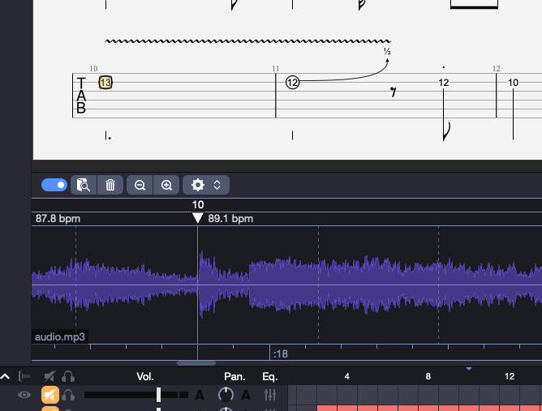

# guitar-pro-youtube-sync
Generate Guitar Pro tabs from Songsterr and sync them with YouTube audio. Produces a `.gp` file with embedded audio and per-measure tempo mapping so your tab plays back in time with YouTube.



## Download

Pre-built executables are available:

**[Download the latest release](https://github.com/teaqu/guitar-pro-youtube-sync/releases/latest)**

| Platform | File |
|----------|------|
| Windows | `guitar-pro-sync-windows-x86_64.exe` |
| macOS (Apple Silicon) | `guitar-pro-sync-macos-arm64.zip` |
| macOS (Intel) | `guitar-pro-sync-macos-x86_64.zip` |
| Linux | `guitar-pro-sync-linux-x86_64.zip` |

Download the file for your platform and extract it if it is a ZIP. Follow the walkthrough below to create your first file.

> **Windows:** Windows Defender or SmartScreen may flag the download. Click **More info** → **Run anyway**.

## Using the downloaded executable

1. **Launch the executable** to open the text prompts. You can double-click it or run it from a terminal in the folder where you extracted it.
2. **Paste a Songsterr URL or song ID**, then press **Enter**. For example, use `https://www.songsterr.com/a/wsa/metallica-enter-sandman-tab-s19` or simply `19`.
3. At **Sync audio to:**, press **Enter** or type `1` to generate a new Guitar Pro file. To sync an existing file instead, type `2`, press **Enter**, and enter its full file path when asked.
4. If generating a new file, at **Include YouTube audio? [Y/n]:**, press **Enter** for yes. Type `n` and press **Enter** to generate only the tab.
5. **Choose a video type** if a menu appears. Press **Enter** for the default or enter the number shown for Full Mix, Backing Track, Solo, or Playthrough. Available options depend on the song; some choices open a second menu.
6. **Wait for the download and sync to finish.** If an audio download fails, follow the browser-cookie instructions below.
7. **Open the result in Guitar Pro.** The final `Done! File saved to:` message gives the full path. With audio syncing selected, the output normally ends in `_synced.gp`.
8. Paste another song URL to process another song, or type `q` and press **Enter** to quit.

Pressing **Enter** without typing accepts the default shown in brackets, such as `[1]` or `[Y/n]`.

### Example: Enter Sandman

For a new tab with the full mix, enter these answers:

| Prompt | Answer |
|--------|--------|
| Enter Songsterr URL or song ID | `19` |
| Sync audio to — Choice [1] | `1` |
| Include YouTube audio? [Y/n] | Press **Enter** |
| Select video type — Choice [1] | `1` (Full Mix in this example) |

The app fetches the instrument tracks, generates `Metallica - Enter Sandman.gp`, attempts to download the selected audio, and creates `Metallica - Enter Sandman_synced.gp` with the timing adjustments.

The app tells you where the file is saved in the **Done! File saved to:** message.

### If YouTube audio fails to download

An error such as `HTTP Error 403: Forbidden` means the audio download was rejected. The app offers to retry using cookies from a browser where you are logged into YouTube:

```text
1. chrome
2. firefox
3. edge
4. brave
5. safari
6. opera
7. Skip audio
```

Make sure you are logged into YouTube in the selected browser. If the download still fails, try another browser where you are logged in.

If a retry fails, the app asks again so you can retry or choose another browser. Choose **Skip audio** (or press **Enter** at `Choice [7]:`) to continue without audio.

**A `_synced.gp` filename or a “Done!” message does not guarantee embedded audio.** If the log says `Skipping audio`, the result contains timing adjustments but no downloaded backing audio.

## What It Does

Songsterr has timing data that maps each measure of a song's tab to a specific timestamp in a YouTube video. This tool:

1. Generates a Guitar Pro file from Songsterr's tab data and timing points
2. Downloads the corresponding YouTube audio via `yt-dlp`
3. Embeds the audio and SyncPoint automations into the Guitar Pro file

The result is a `.gp` file you can open in Guitar Pro with a synced backing track.

## Development Setup

If you want to run from source instead of the pre-built executable:

### Prerequisites

- **Python 3.10+**
- **[ffmpeg](https://ffmpeg.org/)** -- for audio conversion
- **[Deno 2.3+](https://deno.com/)** -- for YouTube JavaScript challenges; must be available on your PATH when running from source. Release builds bundle the runtime.

### Installation

```bash
git clone https://github.com/teaqu/guitar-pro-youtube-sync.git
cd guitar-pro-youtube-sync
python -m venv .venv
source .venv/bin/activate
pip install -r requirements.txt
```

Make sure `ffmpeg` is installed and available on your PATH:

```bash
# macOS
brew install ffmpeg

# Linux
sudo apt install ffmpeg

# Windows - download from https://ffmpeg.org/download.html
```

## Usage

### One-command sync

Pass a Songsterr URL or song ID. The GP file is generated automatically from Songsterr's tab data:

```bash
python sync.py --song "https://www.songsterr.com/a/wsa/gary-moore-parisienne-walkways-tab-s23063"
```

```bash
python sync.py --song 23063
```

This generates `Gary Moore - Parisienne Walkways.gp` and outputs a `Gary Moore - Parisienne Walkways_synced.gp` with the YouTube audio embedded and all measures tempo-mapped.

### Sync with your own GP file

 You can also export the gp file with a plus account on Songsterr which may work better than generating one with this script. If you already have the Guitar Pro file you'd like to sync that instead:

```bash
python sync.py --song 23063 --gp-file my-tab.gp
```

### List available videos

Some songs have multiple video sources (original, alternative, backing track). List them to pick the best one:

```bash
python sync.py --song 23063 --list-videos
```

### Use a specific video

```bash
python sync.py --song 23063 --video-index 2
```
I have only tested this with the default track so unsure how well this works.

### Use browser cookies (if YouTube blocks yt-dlp)

If yt-dlp gets blocked by YouTube, you can use cookies from your browser:

```bash
python sync.py --song 23063 --cookies chrome
```

Supported browsers: `chrome`, `firefox`, `safari`, `edge`, `brave`, `opera`, `vivaldi`

### Generate a GP file only (no sync)

If you don't want the audio you can also use use `gen_gp.py` directly to generate a Guitar Pro file from Songsterr without audio syncing:

```bash
python gen_gp.py --song 23063
python gen_gp.py --song 23063 -o output.gp
```

### Example output

```
[1/5] Fetching song metadata...
Fetching song metadata from: https://www.songsterr.com/api/meta/23063
  Song: Gary Moore - Parisienne Walkways
  Latest revision: 5099457

[2/5] Fetching video points...
Fetching video points from: https://www.songsterr.com/api/video-points/23063/5099457/list
  Found 23 video entries

[3/5] Selecting video entry...
  Using entry 0: videoId=ZfgyFok56fE, feature=alternative, points=101

  Generating GP file from Songsterr...
  Tracks: 9
  Measures: 100
  Tempo: 88 BPM
  Notes: 3870 total, 271 unique
  Beats: 2994 total, 482 unique

[4/5] Downloading YouTube audio...
  Audio saved: .tmp_audio.mp3

[5/5] Syncing GP file...
  Original tempo: 88.0 BPM
  Measures: 100
  Time signatures: 6/8
  Embedding audio: .tmp_audio.mp3 (6.0 MB)

=== Sync Summary ===
  Measures: 100
  Video points: 101
  BPM range: 79.3 - 189.5
  Average BPM: 91.4

Saved: Gary Moore - Parisienne Walkways_synced.gp
Done!
```

## How It Works

### GP file generation (`gen_gp.py`)

1. Fetches song metadata and all track data from Songsterr
2. Converts Songsterr's JSON format into Guitar Pro's GPIF XML format (notes, beats, bars, rhythms, etc.)
3. Deduplicates notes and beats for compact file sizes
4. Handles instrument-specific details: drum kits with neutral clef and MIDI channel 10, string tunings, bends, slides, harmonics, etc.
5. Packages everything into a `.gp` ZIP archive using `blank.gp` as a template

### Audio sync (`sync.py`)

1. Fetches video points from `songsterr.com/api/video-points/{song_id}/{revision_id}/list` -- timestamps (in seconds) marking where each measure starts in the YouTube video
2. Downloads audio from YouTube using `yt-dlp` and converts to MP3
3. Computes per-measure BPMs by dividing the measure length (in quarter notes, derived from the time signature) by the duration between consecutive video points
4. Patches the `.gp` file (a ZIP containing XML) by injecting SyncPoint automations and embedding the MP3 as a backing track asset

## Testing

GitHub Actions runs regression tests on Linux, Windows, and macOS (Apple Silicon and Intel), using Python 3.12 and 3.14, for pushes to `main` and pull requests. It also builds each executable and runs an offline end-to-end test with system Deno and FFmpeg removed from PATH. The test checks bundled JavaScript resources, downloads generated audio from a local test server, converts and trims it, and verifies the audio and sync points in the resulting GP archive.

Run the same checks locally:

```bash
# Offline end-to-end check (requires Deno and FFmpeg when running from source)
python main.py --self-test

# Check a built executable with no system media tools available
python scripts/check_executable.py dist/guitar-pro-sync-macos-arm64

# Live Songsterr → YouTube audio → synced GP check
python main.py --live-test
```

The live check runs weekly on Linux, Windows, and macOS, or manually through **Actions → Build Executables → Run workflow → live_tests**. It uses public song data and never reads browser cookies. Failed packaged or live checks retain logs as workflow artifacts. Live failures can reflect upstream changes or restrictions on the runner's network, so they are separate from the offline release checks.

Browser regression tests simulate Safari permission denial and YouTube cookie errors while exercising the real prompts and retry flow. They cannot verify your personal browser login or grant macOS privacy permissions. Safari cookie access still requires permission from the user; the app explains how to grant it or lets you choose another browser.

The project includes test suites for `sync.py` and `gen_gp.py`:

```bash
# Install test dependencies first
source .venv/bin/activate
pip install -r tests/requirements-test.txt

# Run all tests
pytest

# Run tests excluding slow ones (no audio download)
pytest -m "not slow"

# Run tests with verbose output
pytest -v

# Run tests with coverage report
pytest tests/ --cov=. --cov-report=html --cov-report=term

# Run specific test file
pytest tests/test_sync.py -v
pytest tests/test_gen_gp.py -v
pytest tests/test_integration.py -v

# Run only unit tests (fast, no network required)
pytest tests/test_sync.py tests/test_gen_gp.py -v

# Run only integration tests (slower, requires network)
pytest tests/test_integration.py -v -m integration
```
